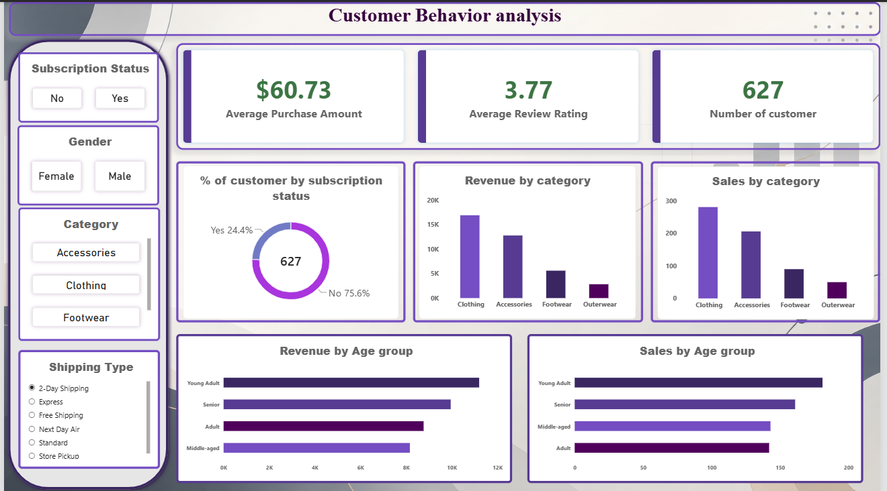

# Customer Shopping Behavior Analysis

An end-to-end data analytics project exploring customer shopping
behavior using **3,900+ customer records**. The project focuses on
understanding purchasing patterns, customer segments, product
performance, discounts, reviews, and subscription behavior, with the
goal of turning customer data into useful business insights.

## Business Problem

Retail businesses collect large amounts of customer shopping data, but
the real value comes from understanding the patterns within it.

This project aims to answer:

> **How can customer shopping data be used to identify trends, improve
> customer engagement, and support marketing and product strategies?**

## Dataset

The dataset contains customer-level shopping information including:

-   Customer demographics
-   Products and categories
-   Purchase amounts
-   Review ratings
-   Discounts and promotional usage
-   Payment methods
-   Seasons
-   Shipping type
-   Subscription status
-   Previous purchases
-   Purchase frequency

## Data Preparation

The initial analysis focuses on preparing the dataset for further
business analysis.

Steps completed:

-   Inspected the dataset structure and summary statistics
-   Checked missing values
-   Handled missing `Review Rating` values using category-level median
    values
-   Standardized column names
-   Created customer age groups
-   Converted purchase-frequency information into a more usable format
-   Identified redundant promotional information and removed the
    duplicate field

## Initial Findings

The current dashboard provides an initial view of customer behavior.

Some of the visible patterns include:

-   **Clothing** generates the highest revenue and has the highest sales
    volume among the categories shown.
-   **Young Adults** account for the highest revenue and sales among the
    age groups shown.
-   **75.6%** of customers in the current dashboard view are
    non-subscribers, compared with **24.4%** subscribers.
-   Average purchase amount is approximately **\$60.73**.
-   Average review rating is approximately **3.77**.

These are initial observations; further analysis will be used to
investigate the relationships behind these patterns.

## Dashboard



The dashboard currently includes:

-   Average Purchase Amount
-   Average Review Rating
-   Customer count
-   Subscription distribution
-   Revenue by category
-   Sales by category
-   Revenue by age group
-   Sales by age group
-   Filters for subscription status, gender, category, and shipping type

## Tools & Technologies

-   **Python**
-   **Pandas**
-   **Jupyter Notebook**
-   **Power BI**
-   **CSV**

## Project Structure

``` text
customer-shopping-behavior-analysis/
│
├── Analysis.ipynb
├── customer_shopping_behavior.csv
├── customer_behavior.pbix
├── dashboards.png
├── Problem.pdf
└── README.md
```

## Project Roadmap

-   [x] Data inspection
-   [x] Data cleaning and preparation
-   [x] Initial exploratory analysis
-   [x] Initial Power BI dashboard
-   [ ] Deeper customer behavior analysis
-   [ ] Analyze discount and spending relationships
-   [ ] Analyze repeat-purchase behavior
-   [ ] Analyze seasonal and payment trends
-   [ ] Develop deeper customer segments
-   [ ] Final business insights and recommendations
-   [ ] Final dashboard refinement

## Project Status

**In Progress**

This repository represents the current stage of the project. The
analysis and dashboard will be expanded as additional business questions
are investigated.
